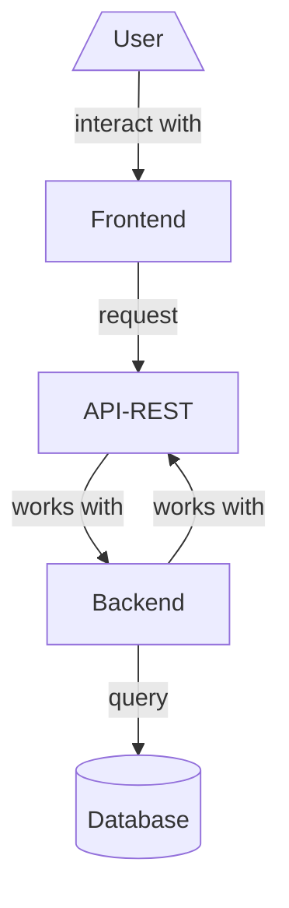

<h1 align="left">Information about the technical and creative process</h1>

  

The project contains two services, one dedicated to the Backend connected to an API REST and another dedicated to the Frontend which through a series of configured routes makes requests to the API and brings the information requested by the user.

Project Structure:

Architecture graphic:

<h2 align="left">Making the Backend</h2>

The Backend consists of a Flask service connected to an API REST in which through a series of resources we access to the database that contains the credentials established in the project models.

<h3 align="left">Development process:</h3>

<h4 align="left">

* Creation of the App:

</h4>  

To create the application, an __app.py__ file must be created where the application must be initialized along with its respective functionalities.

An __init.py__ is then created in the main folder, which allows the folder containing the app.py file to be converted to a Python package. This with the objective that modules and packages can be imported into the Flask application in an easier and more organized way.

<h4 align="left">
  
* Building Models:

</h4>

In order for the service to work, we must create the credentials that will contain the data in each Object of our application.

<h4 align="left">

* Database connection and relationships:

</h4>

These data will be stored in our SQLite3 Database.

Relationships with the models.

<h4 align="left">
  
* Building Resources:

</h4>

Next, we must build the resources that will operate the different HTTP methods in our API.

Poem Resources structure and implementation.

<h4 align="left">
  
* Authentication:

</h4>

We need to implement authentication to prevent unauthorized users from accessing private views.

For this we use JWT (JSON Web Token), which consists of generating a Token that has three parts encoded in Base64, each separated by a dot.

We start with importing the Flask functionality for JWT.

Then, we proceed to decorate the functions that require some kind of authentication.

<h4 align="left">
  
* Mail:

</h4>

Finally, we created an email service that can notify users when their poems are rated.

And we add it to the POST method of Rating resource.

<h2 align="left">Making the Frontend</h2>

The Frontend consists of a Flask service that connects to the Backend service. To do this, I use a series of functions and routes that execute HTTP methods and obtain the data from the website by making requests to the API REST. Finally I send them to an HTML template that is responsible for displaying the data on the page.

<h3 align="left">Development process:</h3>

<h4 align="left">

* Creation of the App:

</h4>  

Since the Frontend is a different service from the Backend, we must create an __app.py__ file that initializes the application.

And then reference a __init.py__ file.

<h4 align="left">

* Templates design:

</h4>

We created a series of templates that will serve as an interactive interface so that the user can interact with the web page. For this we use Bootstrap, a set of open source tools for designing websites and web applications.

We set some styles as CSS files and images.

<h4 align="left">

* Routes and functions configuration:

</h4>

Lastly, we configure the routes that will provide the context to our templates.

The routes are responsible for making requests to the API when the user interacts with the Frontend. For this we use functions stored in __functions.py__, which execute the request and return the information to the route.

Here we have the function to get poems stored in __functions.py__, that requests the information with the API Url and then returns the context.

Then, we make a function call from the requesting route, and render the corresponding template passing the requested information.

Finally, we show the information using Jinja2 engine in the template.

<h2 align="left">Final Result</h2>

We have our Poem webpage working successfully with complete responsive interface and fast data collection.

